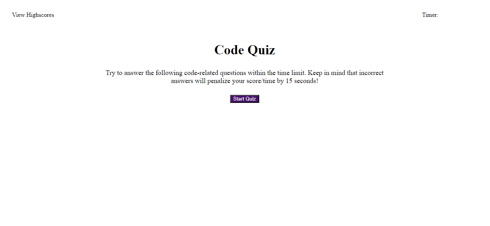
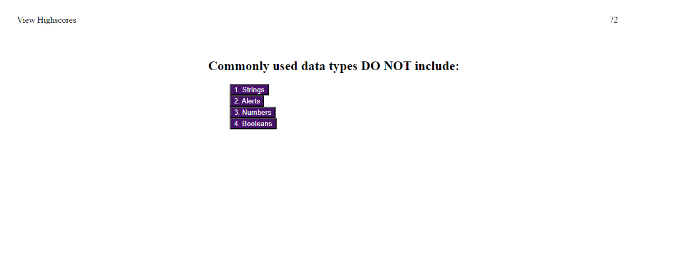
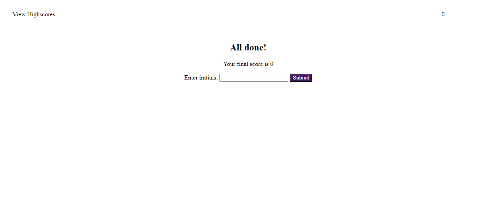

# Coding-Quiz-Week-4-Challenge

# Link:
https://deverstater07.github.io/Coding-Quiz-Week-4-Challenge/

# Description

This project was to create an interactive timed code quiz webpage that stores highscores.
This project allowed me to gain a better understanding of creating and appending elements, changing an elements attributes, creating timers and event listeners in javascript and how to utilise local storage and JSON to stringify objects for storage and parse stored strings back into objects. Through this project I was able to utilise this improved knowledge to dynamically create elements and set specific attributes for them all through javascript.

# Installation

N/A

# Usage

To start the quiz click on the "Star Quiz" button.

Upon clicking the "Start Quiz" button the timer in the top right of the screen will start counting down from 75 and the question and answers will appear on screen. Click on the button with the answer that you think is correct. It will then change to the next question and answers. If you get a question wrong you will lose 15 seconds off your timer. Once you have either answered all 5 questions or run out of time, the quiz will finish and show the finished page.

Once you have finished you will be shown your score and asked to submit your initials. Once you have input your initials and submitted you will be redirected to the highscore screen.

The highscore screen will show the scores of all locally saved scores from previous attempts in descending order. From here you can either go back to the start of the quiz by clicking on the "Go Back" button or you can clear all locally saved scores and reset the scoreboard by clicking the "Clear Highscores" button.

# Credits

N/A

# License

N/A